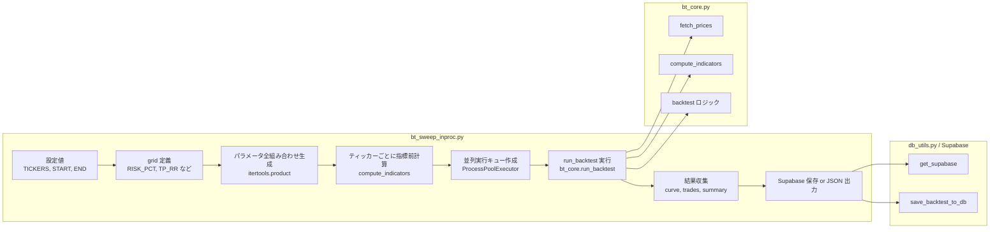
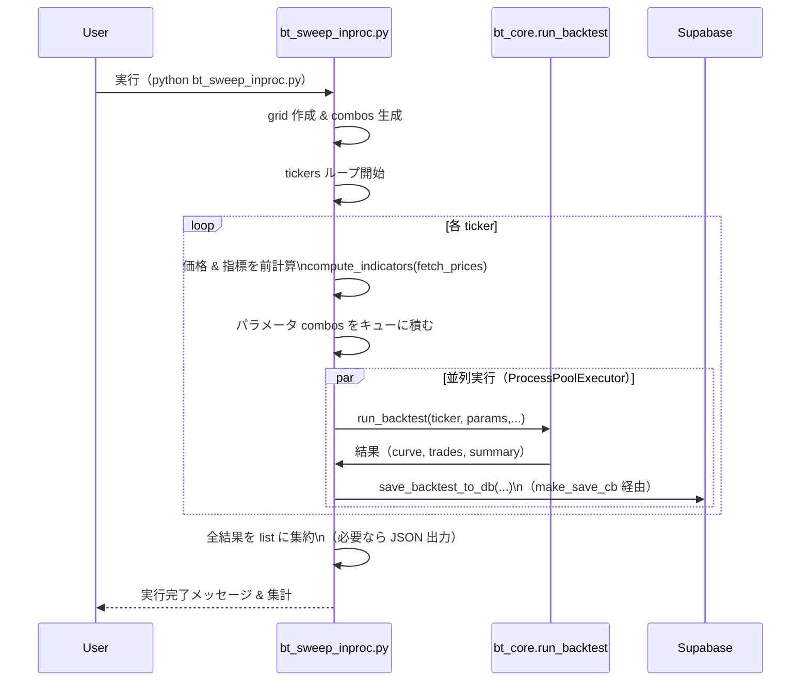

# bt_sweep_inproc.py 仕様書（ドラフト）

> 半自動化取引システム用：パラメータ・銘柄スイープ実行モジュール  
> 対象ファイル：`bt_sweep_inproc.py`（2025-11 時点）

---

## 1. 役割と位置づけ

### 1.1 モジュールの役割

`bt_sweep_inproc.py` は、

- 複数の **銘柄（ticker）** と  
- 複数の **パラメータ組み合わせ（grid search）**

に対して、`bt_core.py` の `run_backtest()` を **並列実行**し、  
その結果を **Supabase への保存／JSON 出力** する「外側の制御モジュール」です。

### 1.2 他モジュールとの関係

- `bt_core.py`  
  - `fetch_prices()`：価格データ取得  
  - `compute_indicators()`：テクニカル指標計算  
  - `run_backtest()`：バックテスト本体（単一ティッカー×単一パラメータ）

- `db_utils.py`  
  - `get_supabase()`：Supabase クライアント取得  
  - `save_backtest_to_db()`：Supabase への保存処理

`bt_sweep_inproc.py` は **これらのモジュールを組み合わせて「大量のバックテストを回す」** ことに特化しています。

---

## 2. 全体アーキテクチャ

### 2.1 コンポーネント図（Mermaid）

## 3.　主な関数・処理
### 3.1 make_save_cb(ticker: str) (python)

def make_save_cb(ticker: str):
    """ Supabase 保存コールバックを生成 """
    sb = get_supabase()
    def _cb(obj):
        curve  = obj["curve"]
        trades = obj["trades"]
        params = obj["params"]
        result = obj["summary"]
        save_backtest_to_db(sb, ticker, params, result, curve, trades)
    return _cb

目的
- run_backtest() の結果（obj）を受け取り、
　Supabase に保存するための コールバック関数を生成します。

入力
- ticker: str
　- バックテスト対象の銘柄コード（例："6702.T"）

内部処理
1. get_supabase() で Supabase クライアント取得
2. ネスト関数 _cb(obj) を定義
- obj["curve"]：残高推移（equity curve）
- obj["trades"]：約定履歴
- obj["params"]：バックテストパラメータ
- obj["summary"]：集計指標（final_equity, total_return, sharpe など）
3. save_backtest_to_db() を呼び出し、1 run 分を保存
4. _cb を返却

出力
- Callable[[dict], None] 型のコールバック
　-run_backtest(..., save_cb=make_save_cb(ticker)) のような形で利用

## 4. パラメータスイープの仕様
### 4.1 grid の構造(python)
 コード中で定義される grid は、バックテストで探索するパラメータ集合です（例）：

grid = {
    "CAPITAL":       [3_000_000.0],
    "PER_TRADE":     [500_000.0],
    "LOT_SIZE":      [100],           # 100株単位
    "RISK_PCT":       [0.003, 0.004, 0.005],
    "TAKE_PROFIT_RR": [1.2, 1.6, 2.0],
    "MAX_HOLD_DAYS":  [6, 10],
    "STOP_SLIPPAGE":  [0.0025, 0.0040],
    "EXIT_ON_REVERSE":[True],
    "VOL_SPIKE_M":    [1.4, 1.6, 1.8],
    "MACD_ATR_K":     [0.10, 0.15, 0.20],
    "RSI_MIN":        [45.0],
    "RSI_MAX":        [70.0],
    "GAP_ENTRY_MAX":  [0.03, 0.05],
}
keys   = list(grid.keys())
combos = list(itertools.product(*grid.values()))

仕様
- grid は「パラメータ名 → 候補値リスト」の dict
- itertools.product(*grid.values()) で 全組み合わせ（デカルト積） を列挙
- 1つの組み合わせは dict(zip(keys, combo)) によって
　run_backtest() に渡される params となる

### 4.2 主なパラメータの意味
- CAPITAL：バックテスト時の総資金（例：3,000,000 円）
- PER_TRADE：1 トレードあたりの最大投入額（例：500,000 円）
- LOT_SIZE：売買単位株数（例：100 株）
- RISK_PCT：1 トレードのリスク（％）
- TAKE_PROFIT_RR：利確目標（R 倍）
- MAX_HOLD_DAYS：最大保有日数
- STOP_SLIPPAGE：ストップ幅調整係数
- EXIT_ON_REVERSE：反転シグナルで強制クローズするか
- VOL_SPIKE_M / MACD_ATR_K / RSI_MIN / RSI_MAX / GAP_ENTRY_MAX：
　エントリー判断に使うテクニカル条件

## 5. 実行フロー
### 5.1 高レベルフロー（Mermaid）

### 5.2 具体的な処理ステップ
1. 設定の読み込み
- 環境変数 or コード内定数から
　- TICKERS（["6702.T", "3778.T", ...]）
　- START / END
　- grid
　　を決定
2. パラメータ全組み合わせの生成
- keys = list(grid.keys())
- combos = list(itertools.product(*grid.values()))
3. ティッカーごとの指標前計算
- compute_indicators(fetch_prices(tkr, start)) を実行
- per_ticker_ind[tkr] = ind のような dict に保存
　→ 各ティッカーで指標計算を1回に抑えて、速度を最適化
4. 並列実行のセットアップ
- ProcessPoolExecutor(max_workers=N) を生成
- 各 ticker × params ごとに run_backtest() をサブプロセスに投げる
- fut2meta[fut] = (tkr, params) のように Future とメタ情報を紐付け
5. 結果収集 & 進捗表示
- for i, fut in enumerate(as_completed(fut2meta), start=1):
　- row = fut.result() で結果取得（row は dict）
　- results.append(row) に追加
　- print(f"[{i}/{len(fut2meta)}] {row['ticker']} done")
6. 保存処理
- Supabase 保存：
　- make_save_cb(ticker) を通じて save_backtest_to_db が呼ばれる
- JSON 出力（必要に応じて）：(python)
with open("sweep_inproc.json", "w", encoding="utf-8") as f:
     json.dump(results, f, ensure_ascii=False, indent=2)
7. 終了ログ
- 実行時間を計測し、[SWEEP] finished: {len(results)} runs time=... と表示

## 6. 入出力仕様
### 6.1 入力（主にコード内／環境変数）
- ティッカーリスト
　例：SWEEP_TICKERS = ["6702.T", "3778.T", ...]
- 期間
　- start = "2023-01-01"
　- end = "2025-11-04" など
- grid
　- 前述のパラメータ候補 dict
### 6.2 出力
- 標準出力
　- 進捗ログ：[i/total] TICKER done
　- 最終統計：[SWEEP] finished: X runs time=YmZZ.Zs
- Supabase
　- テーブル（例）：backtests に対して
　　- ticker
　　- params（JSON）
　　- summary（最終資産、リターン、DD、Sharpe 等）
　　- curve（残高推移）
　　- trades（約定履歴）
　　が 1 run ごとに保存される。
- JSONファイル（任意）
　- sweep_inproc.json などに results をまとめて保存可能
　- 各要素は 1 run 分の dict
　（ticker, params, metrics など）

## 7. 今後の拡張アイデア（メモ）
※仕様書の一部として、将来の拡張案もメモしておきます。
1. 採用銘柄フィルタをこのスクリプト内でやる
- total_return > 0
- n_trades >= 20
- sharpe > 0.5
　などの条件でフィルタリングし、「採用候補リスト」を JSON or Supabase に別テーブルで保存。
2. 1日1トレード用の「ベスト銘柄選定ロジック」との連携
- バックテスト結果から「安定担当（例：6702）」と「攻撃担当」を分類する。
3. GitHub Actions との連携
- 日次・週次で自動実行し、最新の runs を Supabase に更新する。

## 8. まとめ
- bt_sweep_inproc.py = 「複数銘柄×複数パラメータの総当たり実行＆保存担当」
- 実際のバックテストロジックは bt_core.py の run_backtest() に集約
- Supabase 保存用のコールバック make_save_cb() を通じて、結果は全て DB に集約
- grid と tickers を差し替えることで、
　同じロジックでユニバース全体を回して「相性の良い銘柄」を探索する基盤 になっている
この .md をベースに、あとから
- 実際に使っている SWEEP_TICKERS の一覧
- Supabase のテーブル名・カラム仕様
- 実運用で採用する「採用銘柄判定ルール」
などを書き足していけば、「半自動化取引システム・バックテスト基盤」の正式仕様書として育てていけます。