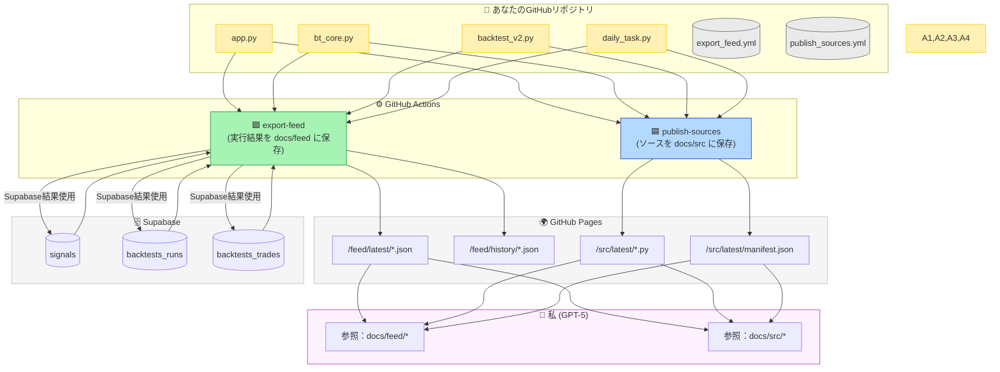

## ChatGPTと更新したソースプログラムや実行結果データを共有する仕組み

```mermaid
graph TD
  subgraph UserSide["👤 あなたのGitHubリポジトリ"]
    A1[app.py]:::src
    A2[bt_core.py]:::src
    A3[backtest_v2.py]:::src
    A4[daily_task.py]:::src
    WF1[(export_feed.yml)]:::wf
    WF2[(publish_sources.yml)]:::wf
  end

  subgraph Actions["⚙️ GitHub Actions"]
    FEED["🟩 export-feed\n(実行結果を docs/feed に保存)"]
    SRC["🟦 publish-sources\n(ソースを docs/src に保存)"]
  end

  subgraph GitHubPages["🌍 GitHub Pages"]
    F1["/feed/latest/*.json"]
    F2["/feed/history/*.json"]
    S1["/src/latest/*.py"]
    S2["/src/latest/manifest.json"]
  end

  subgraph Supabase["🗄️ Supabase"]
    T1[(signals)]
    T2[(backtests_runs)]
    T3[(backtests_trades)]
  end

  subgraph ChatGPT["🤖 私 (GPT-5)"]
    R1["参照：docs/feed/*"]
    R2["参照：docs/src/*"]
  end

  A1 & A2 & A3 & A4 --> FEED
  A1 & A2 & A3 & A4 --> SRC
  FEED --> F1 & F2
  SRC --> S1 & S2
  F1 & S1 & S2 --> R1 & R2
  FEED -->|Supabase結果使用| T1 & T2 & T3
  T1 & T2 & T3 --> FEED
  style FEED fill:#a6f3b3,stroke:#009933
  style SRC fill:#b3d9ff,stroke:#0033cc
  style A1,A2,A3,A4 fill:#fff0b3,stroke:#ffcc00
  style GitHubPages fill:#f5f5f5,stroke:#bbb
  style Supabase fill:#f5f5f5,stroke:#bbb
  style ChatGPT fill:#fdf0ff,stroke:#bb33bb
  classDef src fill:#fff0b3,stroke:#ffcc00
  classDef wf fill:#eaeaea,stroke:#666
```

