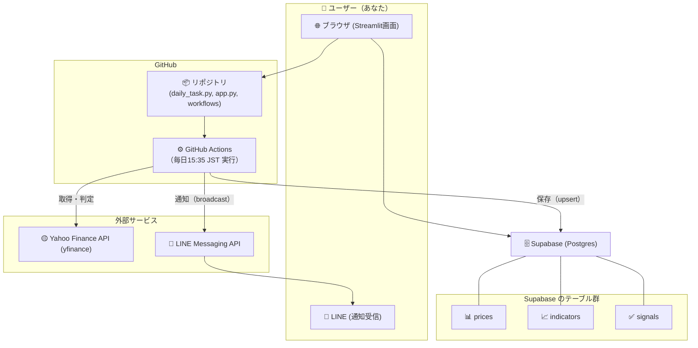
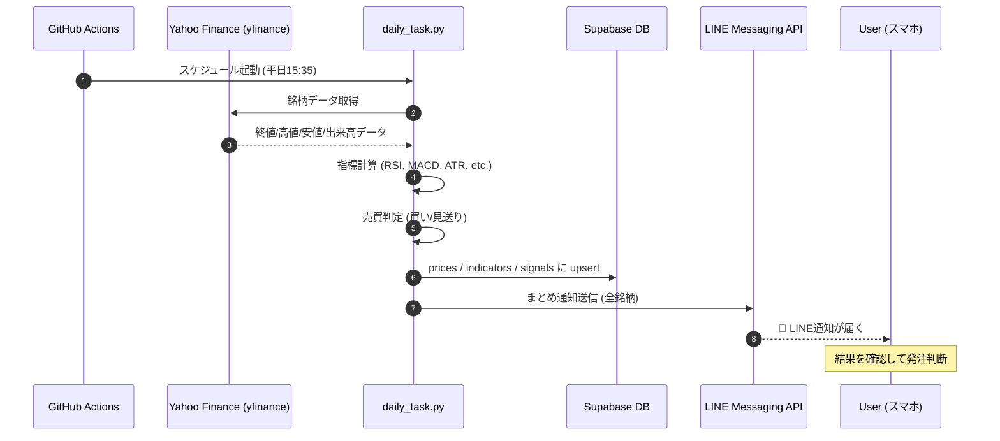

## 株式自動判定・通知システム 仕様書（基本情報）
### システム概要
・目的：東証プライム市場銘柄を対象に、信用取引で利益を上げ続けるための自分専用アシスタントを構築する。
  app.py(画面アプリ）およびdailyjob（毎日引け後にLINEに情報通知）　

・実装構成：

    ・データ収集・判定 → Python (daily_task.py)

    ・データ保存 → Supabase (Postgres)

    ・可視化  → Streamlit アプリ (app.py)

    ・通知 → LINE Messaging API (broadcast)

    ・自動実行 → GitHub Actions (cron)

### 投資方針・ルール
・取引頻度：平日 1日 1回（大引け判定）

・資金運用：100万円（現物ベース、信用取引はあり）

    ・5分割（1回最大20万円程度）

・銘柄条件：

    ・東証プライム市場

    ・株価3,000円以下（初期は2,000円、条件緩和済み）

    ・売上高 500億円以上

    ・ボラティリティ高め

・銘柄数：1銘柄を対象（複数候補から選定済み）

### 実装済み機能
・データ取得

    ・yfinance を利用し、対象銘柄の日足データを取得

    ・リトライ＋フォールバック実装（強化fetch）

    ・MultiIndex列のフラット化済み

・指標計算

    ・移動平均（MA25 / MA75）

    ・RSI（14）

    ・MACD（12,26,9）

    ・ATR（14）

    ・標準偏差（20）

    ・出来高平均（vol_ma20）とスパイク判定

    ・Swing High/Low（20日）

・売買判定ロジック

    ・トレンド判定（MA25 > MA75）

    ・モメンタム（MACD > Signal）

    ・RSI閾値

    ・出来高スパイク

    ・ATRによるボラ確認

    ・判定結果：

        ・「買い」または「見送り」

    ・損切りライン：許容損失率 0.5%（変更可）

    ・実装：judge_action() に集約

・データ保存

    ・Supabase (Postgres) に upsert で保存

        ・prices（日次価格）

        ・indicators（日次指標）

        ・signals（日次判定）

・通知機能

    ・LINE Messaging API

        ・Secretsに LINE_CHANNEL_TOKEN を保存

        ・現状は broadcast送信 → 登録ユーザーが自分1人なので個人LINEに届く

・通知内容：

    ・日付、銘柄、終値、前日比（値幅・％）、判定（買い/見送り）、理由リスト

    ・銘柄複数の場合は まとめて1通に送信

    ・📈📉🟢🛒 のような絵文字で見やすく改善済み

・自動実行

    ・GitHub Actions

        ・スケジュール：平日 JST 15:35（UTC 06:35）

        ・実行内容：daily_task.py → Supabase保存 → LINE通知

        ・Secrets管理：SUPABASE_URL, SUPABASE_KEY, TICKERS, LINE_CHANNEL_TOKEN

・可視化（Streamlit）

    ・Webアプリ (app.py) にて

        ・サイドバーで銘柄・資金・損切り率を設定

        ・メインチャート：終値と移動平均

        ・サブチャート：RSI・MACD

        ・判定結果の表示

・運用フロー

    1．平日引け後（15:35）、GitHub Actions 実行

    2．yfinanceから全指定銘柄を取得

    3．指標計算・判定

    ・Supabaseへ upsert 保存

    ・LINEにまとめ通知（1通）

    ・スマホで受信・確認 → 手動発注判断

### 実装予定機能（案）

・過去データを基に「このルールで勝てていたか」を可視化（バックテスト）

・銘柄入力、表示をコード（xxxx.T）だけでなく会社名でも可能にする

・リスク設定のUI化を強化
	・「許容損失率」「ATR倍率」「利確R」をプリセット保存（ conservative / default / aggressive ）してワンタップ切替。

・イベント回避の自動化
	・決算発表・重要指標の前後は自動で新規建て禁止フラグに（将来ミスを減らします）。

・銘柄切替と比較
	・さくら以外（さくら・gumi・住友ファーマ等）をセレクトボックスで切替、勝率・期待値のダッシュボードも追加。
	・セレクトボックスに表示する銘柄は一度入力されたもの（DBから持ってくる　最新順に表示）
・休日判定の精緻化（日本の祝日の判定を組み込み）

・買いの判定の時だけLINE通知する

・LINE Messaging APIの使用機能をBroadcastからpushに変更する

・ロングからショートへの拡張（買いだけでなく信用売りの判定を組み込む）

・ファンダメンタル指標その他の判断機能追加
	・テクニカル指標に加えファンダメンタル指標や当該銘柄に一番影響が大きい経済指標（為替相場、日経225、FRB政策等）、他社・業界動向、ニュース、成長性を評価する機能も追加する（AIのDeep Research機能や検索とのAPI連携）

・自己保有株（現物・信用）の情報をDBに登録できる画面機能を別画面で作る
	1．保有株情報を手動で入力・更新
	2．保有株売買、新規建、決済を手動で入力・更新
	3．信用取引については、建玉一覧機能も用意
	4．この画面から新規売買や決済の登録を行うと、楽天証券が提供するマーケットスピード2の機能を利用して実際の売買までを自動で行うようにする。（ただしVBAでのアクセスしか用意されていない）

・LINEのBotで銘柄を入力したらそれに対する判定結果を返す機能を付加する

・Webで実現している機能の縮小版をスマホ（iPhone）向けに開発する

・認証設定を強固化

